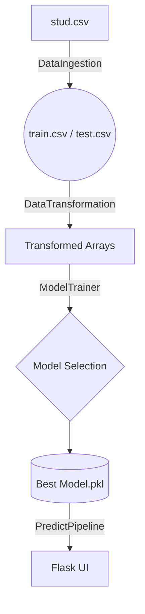
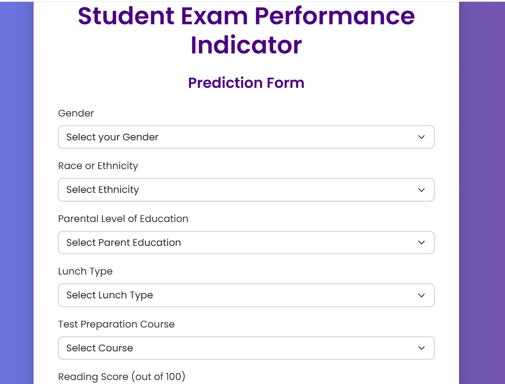

## This is End to End ML Project
# End‑to‑End ML Pipeline – **Student Exam Performance Predictor**

<div align="center">
  
  
  
</div>


## 1. Overview

This repository contains a full‑lifecycle Machine Learning application that predicts students’ mathematics scores based on demographic and educational features. The pipeline covers everything from raw data ingestion and experiment tracking to model serving behind a lightweight Flask UI, wrapped inside a Docker container for reproducible deployment.

**Core objectives**

* Automate data ingestion, preprocessing and feature engineering
* Evaluate and select the best regression model (Linear Regression/Decision Tree/XGBoost/RandomForest etc.)
* Serve real‑time predictions through a web form
* Provide one‑command deployment via Docker

Dataset: *Students Performance in Exams* from Kaggle (n = 1 000) https://www.kaggle.com/datasets/spscientist/students-performance-in-exams?datasetId=74977. The dataset is included in `notebook/data/stud.csv`.

---

## 2. Features

* 📊 **EDA Jupyter notebooks** for quick insights
* 🔄 **Modular pipeline** (`src/`) with *DataIngestion → DataTransformation → ModelTrainer → ModelEvaluator* components
* 🏷️ **Persisted artifacts** (scaler, encoders, trained model) stored in `/artifacts`
* 🌐 **Flask UI** (`app.py`, `templates/home.html`) for interactive predictions
* 🐳 **Dockerfile** with slim Python 3.10 base image – run anywhere with the same results
* ☁️ **Docker Hub** image → `docker pull eyasu/studentperformanceapp`
* 🧪 **Unit‑test‑ready** structure and detailed logging. check it in the logs folder.

---

## 3. Tech Stack

| Layer         | Tools                                          |
| ------------- | ---------------------------------------------- |
| Language      | Python 3.10                                    |
| ML libraries  | Pandas, NumPy, Scikit‑learn, XGBoost |
| Serving       | Flask + Jinja templates                        |
| Visualisation | Matplotlib, Seaborn, Plotly                    |
| Packaging     | Docker                                         |
| CI/CD         | GitHub Actions\*                               |

\* Activate the bundled workflow in `.github/workflows` to enable automatic tests & image pushes on every commit.

---

## 4. Project Architecture



---

## 5. Quick Start

### 5.1 Run with Docker (zero setup)

```bash
# Pull pre‑built image
docker pull eyasu/studentperformanceapp:latest

# Run container
docker run -p 5000:5000 eyasu/studentperformanceapp
           
```

Open [http://localhost:5000](http://localhost:5000) and enter student details to get an instant maths‑score prediction.

### 5.2 Manual setup (local)

```bash
git clone https://github.com/eyasu11321238a/End-to-End-ML-Project.git
cd End-to-End-ML-Project

# (Optional) create venv / conda env
pip install -r requirements.txt

# Train the pipeline & create artifacts
python src/components/data_ingestion.py

# Launch UI
python app.py  # default http://127.0.0.1:5000
```

---

## 6. Train or Retrain the Model

The training script is embedded in `src/components/data_ingestion.py`:

```bash
python src/components/data_ingestion.py
```

This will:

1. Read `notebook/data/stud.csv`
2. Split into train/test (80/20)
3. Transform categorical & numerical features
4. Compare multiple regressors and persist the best one to `artifacts/model.pkl`
5. Export scaler and encoder objects for inference

Modify hyper‑parameters in `src/components/model_trainer.py` if you wish to experiment.

---

## 7. Web UI



The UI collects the six input features and returns the predicted math score.

| HTTP Method | Endpoint       | Description                          |
| ----------- | -------------- | ------------------------------------ |
| GET         | `/`            | Render home page                     |
| POST        | `/predictdata` | Accept form data & return prediction |

---

## 8. Repository Structure

```
.
├── .ebextensions/              # AWS EB config (optional)
├── artifacts/                  # Saved datasets & models
├── notebook/                   # Jupyter notebooks & data
│   ├── data/stud.csv
│   └── EDA.ipynb
├── src/                        # Core ML package
│   ├── components/             # Pipeline stages
│   ├── logger.py
│   ├── exception.py
│   └── pipeline/               # PredictPipeline for inference
├── templates/                  # Flask HTML templates
├── app.py                      # Flask app
├── Dockerfile
├── requirements.txt
└── README.md                   
```

---

## 9. Results

| Metric | Value    |
| ------ | -------- |
| MAE    | **5.17** |
| RMSE   | **6.45** |
| R²     | **0.87** |

*(Evaluated on 20 % hold‑out set; see `artifacts/model_report.json` for details). Update after retraining.*

---


